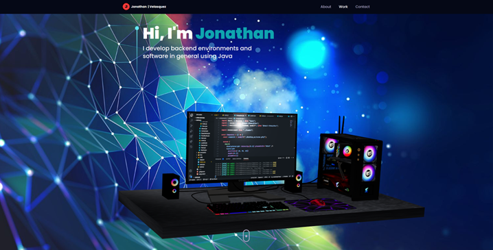

🚀 Jonathan Velasquez | Portfolio

🔗 Live Demo: https://jonathanvelasquez.netlify.app/

✨ About Me

I’m a passionate software developer with expertise in:

⚡ Frontend: React, React Native, JavaScript, TypeScript

⚡ Backend/Systems: Rust, Java, MySQL

⚡ Blockchain: Web3, Smart Contracts

A quick learner and team player, I thrive in collaborative environments to build efficient, scalable, and user-friendly solutions that solve real-world problems. Let’s turn your ideas into reality!

🎨 Portfolio Highlights

This portfolio is a 3D-interactive showcase of my work, built with:

    Three.js (immersive 3D visuals)

    React (dynamic UI)

    JavaScript/TypeScript (smooth functionality)

Designed to reflect creativity + technical excellence, it blends sleek aesthetics with seamless performance.

📸 Preview

 
     

🛠️ Tech Stack

Category	Technologies

Frontend	React, Three.js, JavaScript, TypeScript

Backend	    Java, Rust, MySQL

Blockchain	Web3, Ethereum, Smart Contracts

Tools & Methods	Git, Agile, CI/CD

🌟 Why Work With Me?

✅ Problem-Solver: Focused on clean, maintainable code.

✅ Adaptable: Master new tech stacks quickly.

✅ Collaborative: Love brainstorming with teams to innovate.

✅ User-Centric: Build apps that people enjoy using.

📩 Let’s Connect!

📧 Email: johedvelca@gmail.com

💼 LinkedIn: www.linkedin.com/in/johedvelca

🐙 GitHub: https://github.com/JOHED-Velca

🎯 Next Steps?

👉 Explore my portfolio: https://jonathanvelasquez.netlify.app/

👉 Contact me for collaborations or freelance opportunities!